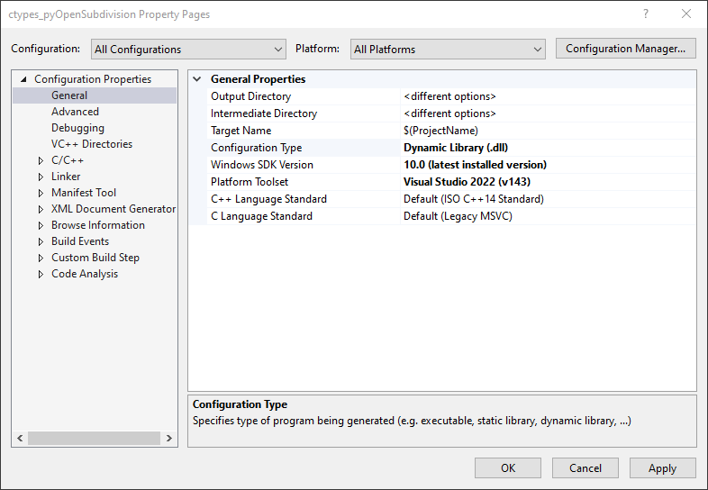
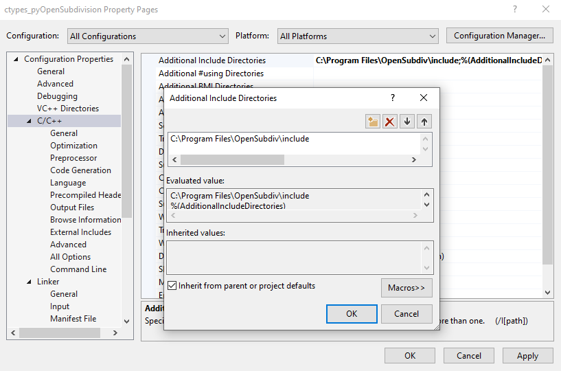
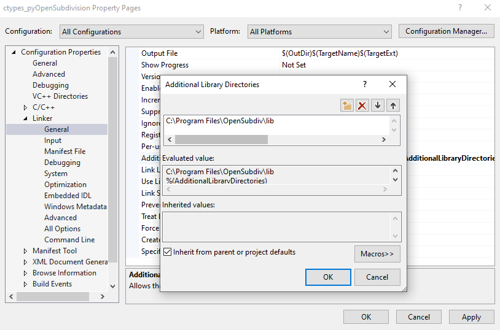
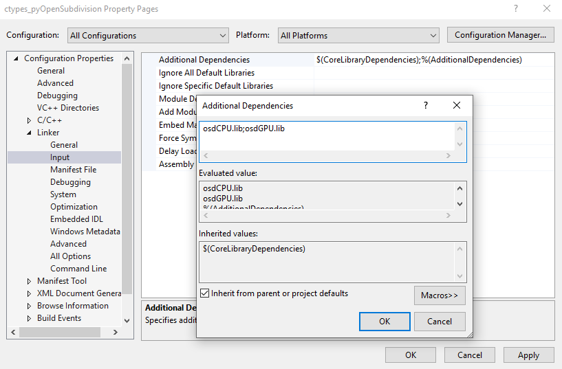

# pyOpenSubdivision
A Python wrapper (implemented using [`ctypes`](https://docs.python.org/3/library/ctypes.html)) for the [OpenSubdiv C++ Library](https://github.com/PixarAnimationStudios/OpenSubdiv) [far](https://github.com/PixarAnimationStudios/OpenSubdiv/tree/release/opensubdiv/far) topology refiner.

<div align="center"></div>

## Code
- [ ] Discuss 

## General requirements:
- [CMake](http://www.cmake.org)
- [Python 3.8+](https://www.python.org/downloads/)
- [Git](https://git-scm.com/download/linux)

## Building on Linux
1. Install [General Requirements](#general-requirements).
2. Install [GLFW](https://www.glfw.org/) (Optional, but makes building `OpenSubdiv` smoother) 
    ```
    sudo apt-get install libglfw3 libglwf3-dev
    ```
    This should create/install the files `libglfw3.a` at `/usr/local/lib/` and `gflw3.h` at `/usr/local/include/GLFW/`.
3. Install `doxygen` and `xorg-dev` (possibly optional)
    ```
    sudo apt-get install doxygen xorg-dev
    ```
4. Clone [OpenSubdiv](https://github.com/PixarAnimationStudios/OpenSubdiv) 
    ```
    git clone https://github.com/PixarAnimationStudios/OpenSubdiv.git
    ```
5. [Build and Install OpenSubdiv](https://github.com/PixarAnimationStudios/OpenSubdiv#linux) 
    ```shell
    $ cd OpenSubdiv 
    $ mkdir build 
    $ cd build

    $ cmake -D NO_PTEX=1 -D NO_DOC=1 -D NO_OMP=1 -D NO_TBB=1 -D NO_CUDA=1 -D NO_OPENCL=1 -D NO_CLEW=1 -D GLFW_LOCATION="/usr/" ..

    $ cmake --build . --config Release --target install
    ```
    This should create an `opensubdiv/` directory at `/usr/local/include/`
    ```
    .
    └── opensubdiv/
        ├── far/  
        ├── hbr/   
        ├── osd/   
        ├── sdc/   
        ├── version.h
        └── vtr/
    ```
    And `libosdCPU` and `libosdGPU` library files at `/usr/local/lib/`
    ```
    .
    ├── libosdCPU.a
    ├── libosdCPU.so -> libosdCPU.so.3.4.4
    ├── libosdCPU.so.3.4.4
    ├── libosdGPU.a
    ├── libosdGPU.so -> libosdGPU.so.3.4.4
    └── libosdGPU.so.3.4.4
    ```
1. Compile 
    ```
    g++ ctypes_subdivider.cpp -losdGPU -losdCPU -o ctypes_OpenSubdiv.so -fPIC -shared
    ```
2. Test 
    ```shell
    $ python3 ctypes_pyOpenSubdiv.py 
    v [-0.2777777910232544, -0.2777777910232544, 0.2777777910232544]
    v [0.2777777910232544, -0.2777777910232544, 0.2777777910232544]
    v [-0.2777777910232544, 0.2777777910232544, 0.2777777910232544]
    v [0.2777777910232544, 0.2777777910232544, 0.2777777910232544]
    v [-0.2777777910232544, 0.2777777910232544, -0.2777777910232544]
    v [0.2777777910232544, 0.2777777910232544, -0.2777777910232544]
    v [-0.2777777910232544, -0.2777777910232544, -0.2777777910232544]
    v [0.2777777910232544, -0.2777777910232544, -0.2777777910232544]
    v [0.0, 0.0, 0.5]
    v [0.0, 0.5, 0.0]
    ...
    e [0, 14]
    e [0, 25]
    e [1, 15]
    e [2, 17]
    e [3, 16]
    e [3, 18]
    e [4, 20]
    e [5, 19]
    e [5, 21]
    e [6, 23]
    ...
    f [0, 14, 8, 17]
    f [14, 1, 15, 8]
    f [8, 15, 3, 16]
    f [17, 8, 16, 2]
    f [2, 16, 9, 20]
    f [16, 3, 18, 9]
    f [9, 18, 5, 19]
    f [20, 9, 19, 4]
    f [4, 19, 10, 23]
    f [19, 5, 21, 10]
    ...
    ```

## Building on Windows ([Visual Studio](https://visualstudio.microsoft.com/))
1. Install [General Requirements](#general-requirements).
2. Install [GLFW](https://www.glfw.org/) (Optional, but makes building `OpenSubdiv` smoother)   
   - Download the [GLFW Windows pre-compiled binaries](https://www.glfw.org/download.html) (64-bit), and unzip file. 
   
3. Clone [OpenSubdiv](https://github.com/PixarAnimationStudios/OpenSubdiv) 
    ```
    git clone https://github.com/PixarAnimationStudios/OpenSubdiv.git
    ```
4. [Build and Install OpenSubdiv](https://github.com/PixarAnimationStudios/OpenSubdiv#windows-visual-studio)     
    From an **administrator** powershell (vary appropriately for Visual Studio version and `GLFW` path):
    ```powershell
    $ cd OpenSubdiv 
    $ mkdir build 
    $ cd build

    $ cmake ^ -DCMAKE_GENERATOR_PLATFORM=x64 -G "<Visual Studio Version>" ^ -D NO_PTEX=1 -D NO_DOC=1 ^ -D NO_OMP=1 -D NO_TBB=1 -D NO_CUDA=1 -D NO_OPENCL=1 -D NO_CLEW=1 ^ -D "GLFW_LOCATION=<path to GLFW>" ^ ..

    $ cmake --build . --config Release --target install
    ```
    For example
    ```powershell
    # Example build command 
    $ cmake ^ -DCMAKE_GENERATOR_PLATFORM=x64 -G "Visual Studio 17 2022" ^ -D NO_PTEX=1 -D NO_DOC=1 ^ -D NO_OMP=1 -D NO_TBB=1 -D NO_CUDA=1 -D NO_OPENCL=1 -D NO_CLEW=1 ^ -D "GLFW_LOCATION=C:/Users/<username>/Desktop/cpp/glfw-3.3.7.bin.WIN64/glfw-3.3.7.bin.WIN64" ^ ..
    ```
    A successful build and install should create an `opensubdiv\` directory at `C:\Program Files\OpenSubdiv\include\` with the following structure
    ```
    C:.
    ├───far
    ├───hbr
    ├───osd
    ├───sdc
    └───vtr
    ```
    And `libosdCPU.lib` and `libosdGPU.lib` library files at `C:\Program Files\OpenSubdiv\lib\`
5. Install [Visual Studio Community](https://visualstudio.microsoft.com/downloads/), include `Desktop Development with C++`. 
6. Create Visual Studio `C++` Project 
   - Create a new, blank, `C++` project in Visual Studio. 
   - Configure to target `Release` and `x64`. 
   - Add `ctypes_subdivider.cpp` to the `Source Files` by right-clicking `Source Files` in the `Solution Explorer`, selecting `Add->Existing Item...`, and navigating to `ctypes_subdivider.cpp` in the browser window. 
   - **Note**: It is also possible to make a C++ project in this directory (the repository) with a `Source.cpp` file containing just the line 
        ```c++
        #include "../ctypes_subdivider.cpp"
        ```
        The following setup steps remain the same. 
7. Configure solution properties (for All builds, All platforms) 

   1. Set the solution Configuration Type to `Dynamic Library (.dll)`
        <div align="center"></div>

        ```
        Right-click Solution -> Properties -> Configuration Properties -> Configuration Type -> Dynamic Library (.dll)
        ```
   2. Add `OpenSubdiv\include` to Additional Include Directories        
        <div align="center"></div>

        ```
        Right-click Solution -> C/C++ -> General -> Additional Include Directories -> C:\Program Files\OpenSubdiv\include
        ```
   3. Add `Opensubdiv\libs` to Additional Library Directories
        <div align="center"></div>

        ```
        Right-click Solution -> Properties -> Linker -> General -> Additional Library Directories -> C:\Program Files\OpenSubdiv\lib
        ```
   4. Add `OpenSubdiv` library binaries to [linker's Additional Dependencies](https://stackoverflow.com/questions/42867030/c-dll-unresolved-external-symbol/42867190#42867190) 
        <div align="center"></div>

        ```
        Right-click Solution -> Properties -> Linker -> Input -> Additional Dependencies -> osdCPU.lib;oscGPU.lib
        ```
8. Build the solution (`Build -> Build Solution`), which should create a `ctypes_OpenSubdiv.dll` file at `x64\Release\`. 
9. Test:
   - Move the `ctypes_pyOpenSubdivision.dll` into the same directory as `ctypes_pyOpenSubdiv.py`.
   - Run `ctypes_pyOpenSubdiv.py`
        ```
        $ python .\ctypes_pyOpenSubdiv.py
        v [-0.2777777910232544, -0.2777777910232544, 0.2777777910232544]
        v [0.2777777910232544, -0.2777777910232544, 0.2777777910232544]  
        v [-0.2777777910232544, 0.2777777910232544, 0.2777777910232544]  
        v [0.2777777910232544, 0.2777777910232544, 0.2777777910232544]   
        v [-0.2777777910232544, 0.2777777910232544, -0.2777777910232544] 
        v [0.2777777910232544, 0.2777777910232544, -0.2777777910232544]  
        v [-0.2777777910232544, -0.2777777910232544, -0.2777777910232544]
        v [0.2777777910232544, -0.2777777910232544, -0.2777777910232544] 
        v [0.0, 0.0, 0.5]
        v [0.0, 0.5, 0.0]
        ...
        e [0, 14]
        e [0, 25]
        e [1, 15]
        e [2, 17]
        e [3, 16]
        e [3, 18]
        e [4, 20]
        e [5, 19]
        e [5, 21]
        e [6, 23]
        ...
        f [0, 14, 8, 17]
        f [14, 1, 15, 8]
        f [8, 15, 3, 16]
        f [17, 8, 16, 2]
        f [2, 16, 9, 20]
        f [16, 3, 18, 9]
        f [9, 18, 5, 19]
        f [20, 9, 19, 4]
        f [4, 19, 10, 23]
        f [19, 5, 21, 10]
        ...
        ```

# ToDo 
## Building on OS X
- [ ] Implement 

## Error Handling and Crash Prevention 
- [ ] Implement 