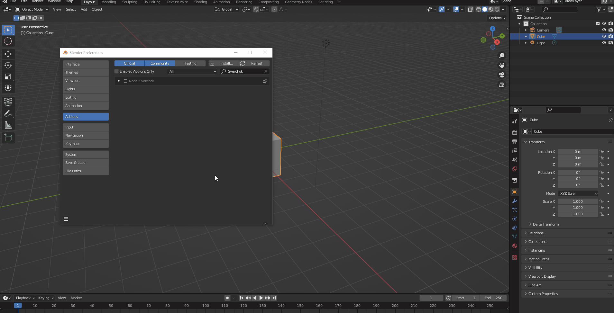
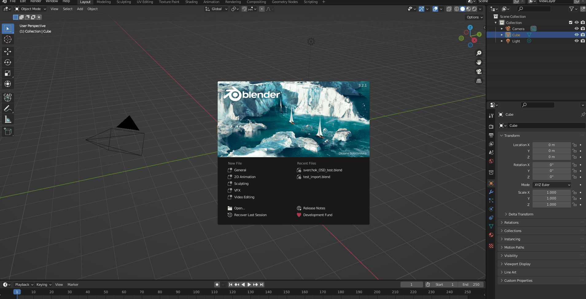
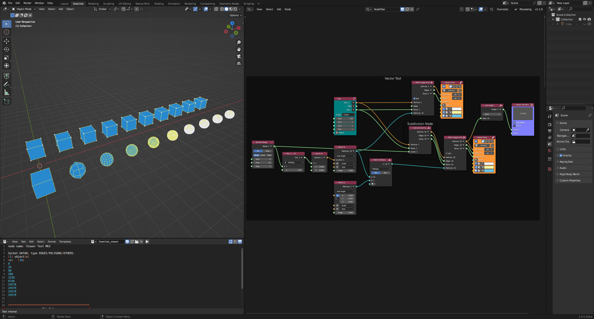
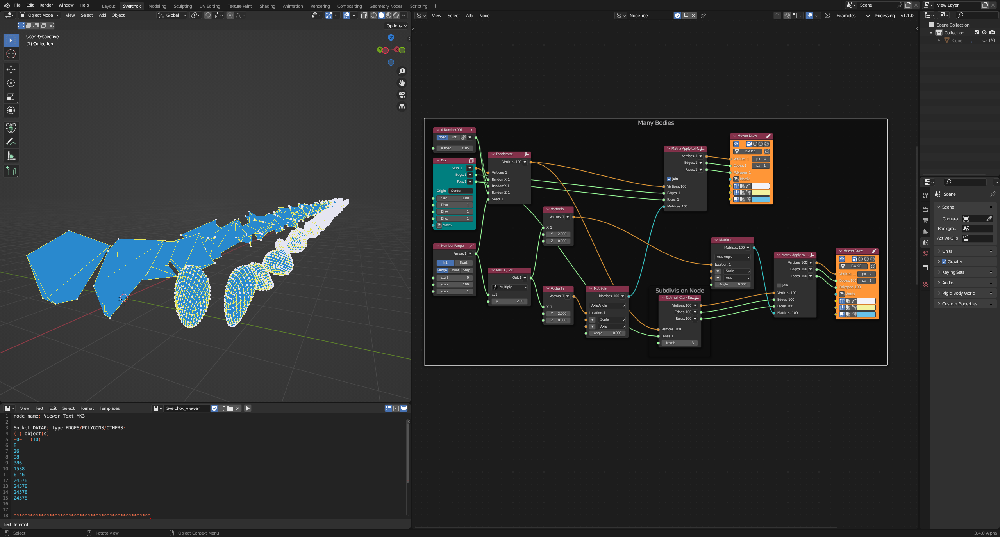
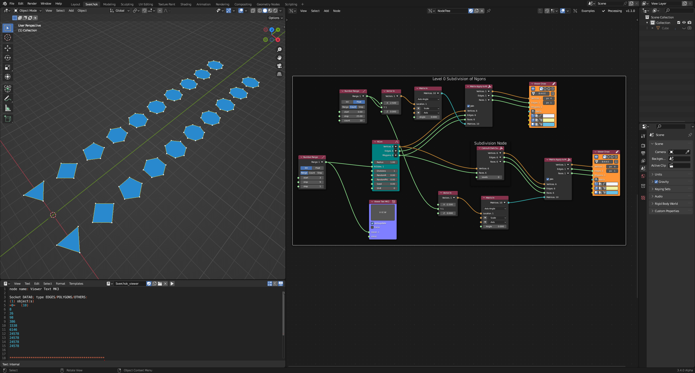
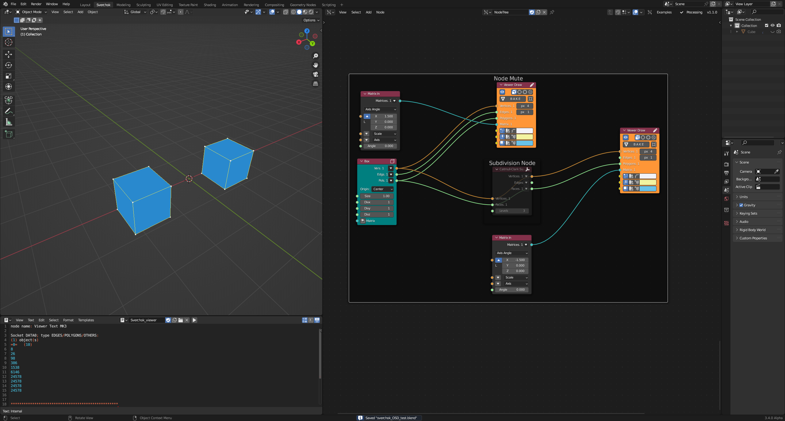

# pyOpenSubdivision
A Python wrapper (implemented using [`ctypes`](https://docs.python.org/3/library/ctypes.html)) for the [OpenSubdiv C++ Library](https://github.com/PixarAnimationStudios/OpenSubdiv) [far](https://github.com/PixarAnimationStudios/OpenSubdiv/tree/release/opensubdiv/far) topology refiner.

<div align="center"></div>

## Updates 
- Added keyword arguments (verbose  (`-v`) and level (`-l <N>`)) to `ctypes_subdivider.cpp` (these are handled by `subdivider::settings`). 
- `ctypes_subdivider.cpp` handles level 0 subdivision better now. 
  - Within the `refine_topology` function, an assertion is made that the number of vertices per face of the refined mesh is 4, i.e. it consists entirely of quads.
  ```c++
  assert(fverts.size() == 4);
  ```
  This assertion is only strictly true if the mesh is actually subdivided (`maxlevel > 0`). Otherwise, it is possible to feed a mesh containing ngons, which if not subdivided (evaluated for `maxlevel = 0`), will fail the all quads assertion, crashing the code. 

  It would seem reasonable to simply ignore the all-quads assertion, but the block that constructs the edges (`for (int i = 0; i < nn_faces; i++) { ... }`) for the refined topology relies on the assumption. Furthermore, ignoring the all-quads assertion would involve returning (to python) a set of faces where each could contain an arbitrary number of vertices, which is very difficult (to the extent that I could not figure out a solution). Conceivably, it would be possible to use the `vertsPerFace` data to reconstruct a flattened (1D) `faceVerts` list; but ultimately, any solution tends to involve reconstructing information that was passed into the refiner in the first place (as opposed to simply passing it through, which is easier said than done), which is not optimal. 

  My solution to this problem was to create a method (`subdivider::edges_only`) that only constructs edges from the incoming mesh data, and can handle faces containing an arbitrary number of vertices. This method only runs if `maxlevel <= 0`. 

  In terms of Sverchok/Blender, the intention here is to have the node generate valid topology when it is *not* muted *and* the subdivision level is 0. When the node *is* muted, the incoming mesh data should be passed directly through (with no edges created), but this can be implemented on the python side. 

  Note that I would use the `edges_only` function for `maxlevel > 0`, but the refined face vertices (`fverts`) are extracted one-by-one (from `reflastlevel`), so this would be slightly tricky to implement, or at least require a for-loop each for extracting the refined faces and constructing the edges from them, where the current solution does both operations in the same loop. For these reasons, I have stuck with the current approach, even though it lacks elegance. 

- Testing is handled a little better now, with the test function integrated directly into the module now. The proper way is still unit tests and CI/CD, but I think this is a step in the right direction. Testing example in this readme have been updated accordingly. 

## Code
- [pyOpenSubdiv @ PyPi](https://pypi.org/project/pyOpenSubdiv/)
  - `pip install pyOpenSubdiv`
- [ ] Discuss 

## Uploading to PyPi
I followed [this guide](https://www.freecodecamp.org/news/build-your-first-python-package/). Pretty simple, at any rate: 
```
python3 setup.py sdist bdist_wheel
twine upload dist/*
```
Note that when updating, it looks like it is necessary to either increment the version number in `setup.py`, or delete the existing version on PyPi and reupload. 

## Building 

## General requirements:
- [CMake](http://www.cmake.org)
- [Python 3.8+](https://www.python.org/downloads/)
- [Git](https://git-scm.com/download/linux)

## Building on Linux
1. Install [General Requirements](#general-requirements).
2. Install [GLFW](https://www.glfw.org/) (Optional, but makes building `OpenSubdiv` smoother) 
    ```
    sudo apt-get install libglfw3 libglwf3-dev
    ```
    This should create/install the files `libglfw3.a` at `/usr/local/lib/` and `gflw3.h` at `/usr/local/include/GLFW/`.
3. Install `doxygen` and `xorg-dev` (possibly optional)
    ```
    sudo apt-get install doxygen xorg-dev
    ```
4. Clone [OpenSubdiv](https://github.com/PixarAnimationStudios/OpenSubdiv) 
    ```
    git clone https://github.com/PixarAnimationStudios/OpenSubdiv.git
    ```
5. [Build and Install OpenSubdiv](https://github.com/PixarAnimationStudios/OpenSubdiv#linux) 
    ```shell
    $ cd OpenSubdiv 
    $ mkdir build 
    $ cd build

    $ cmake -D NO_PTEX=1 -D NO_DOC=1 -D NO_OMP=1 -D NO_TBB=1 -D NO_CUDA=1 -D NO_OPENCL=1 -D NO_CLEW=1 -D GLFW_LOCATION="/usr/" ..

    $ cmake --build . --config Release --target install
    ```
    This should create an `opensubdiv/` directory at `/usr/local/include/`
    ```
    .
    └── opensubdiv/
        ├── far/  
        ├── hbr/   
        ├── osd/   
        ├── sdc/   
        ├── version.h
        └── vtr/
    ```
    And `libosdCPU` and `libosdGPU` library files at `/usr/local/lib/`
    ```
    .
    ├── libosdCPU.a
    ├── libosdCPU.so -> libosdCPU.so.3.4.4
    ├── libosdCPU.so.3.4.4
    ├── libosdGPU.a
    ├── libosdGPU.so -> libosdGPU.so.3.4.4
    └── libosdGPU.so.3.4.4
    ```
6. Compile

    This **does not** work (does not compile the `osd` libraries statically? Throws the error `OSError: libosdCPU.so.3.4.4: cannot open shared object file: No such file or directory` when trying to import `ctypes_OpenSubdiv.so` in e.g. `load_library.py`)
    ```
    g++ ctypes_subdivider.cpp -losdGPU -losdCPU -o ctypes_OpenSubdiv.so -fPIC -shared
    ```
    This ***seems*** to work (compiles the static `osd` `.a`  libraries into `ctypes_OpenSubdiv.so`?) (compile syntax courtesy [this SE answer](https://stackoverflow.com/a/17029312/2391876))
    ```
    g++ ctypes_subdivider.cpp -L/usr/local/lib/ -l:libosdGPU.a -l:libosdCPU.a -o ctypes_OpenSubdiv.so -fPIC -shared
    ```
    Note that `-L/usr/local/lib/` is unnecessary, but included for reference purposes. 

    Some additional convenience commands: 

    Compile directly into pyOpenSubdiv/clib: 
    ```
    g++ ctypes_subdivider.cpp -L/usr/local/lib/ -l:libosdGPU.a -l:libosdCPU.a -o package/pyOpenSubdiv/clib/ctypes_OpenSubdiv.so -fPIC -shared
    ```
    Compile to executable:
    ```
    g++ ctypes_subdivider.cpp -L/usr/local/lib/ -l:libosdGPU.a -l:libosdCPU.a -o ctypes_OpenSubdiv_executable
    ```

7. Test:

    Testing `pyOpenSubdiv` on Linux now uses `docker`, which I installed following [this guide](https://www.zdnet.com/article/whats-new-in-libreoffice-and-how-do-you-install-it-on-macos/).
    
    With `docker` installed, build the test image by running `docker build -t ubuntu_docker .` from within the `dockers` directory. Then, start the container by running `start_docker.sh` from the **root** of this repo. 

    ```bash
    $ ./start_docker.sh 
    ```

    The `start_docker.sh` shell script automatically installs the `pyOpenSubdiv` package to the container, and on exit deletes miscellaneous directories created from installing and running the module, and the container (note that deleting the module directories requires `sudo`). 

    Start `IPython` (run `$ ipython` at the container terminal) (note that using `IPython` is technically optional, and it is only my preference to use it), import the `pyOpenSubdiv` module, load `pyOpenSubdiv.pysubdivision`, and run `pysubdivision.test_pysubdivide()`
    
    ```
    In [2]: import pyOpenSubdiv
    In [3]: from pyOpenSubdiv import pysubdivision
    In [4]: pysubdivision.test_pysubdivide()
    ```

    `pysubdivision.test_pysubdivide()` should produce an output like the following (the `Runtime` tests will more than likely be different between instances and hardware)

    ```ipython
    In [4]: pysubdivision.test_pysubdivide()
    Subdivision Tests
    cube @ 0
    suzanne @ 0
    triangles @ 0
    ngons @ 0
    ngons2 @ 0
    cube @ 1
    suzanne @ 1
    triangles @ 1
    ngons @ 1
    ngons2 @ 1
    cube @ 2
    suzanne @ 2
    triangles @ 2
    ngons @ 2
    ngons2 @ 2

    Verbose Test
    maxlevel 1
    New Vertices 26
    v -0.277778 -0.277778 0.277778
    v 0.277778 -0.277778 0.277778
    v -0.277778 0.277778 0.277778
    v 0.277778 0.277778 0.277778
    v -0.277778 0.277778 -0.277778
    v 0.277778 0.277778 -0.277778
    v -0.277778 -0.277778 -0.277778
    v 0.277778 -0.277778 -0.277778
    v 0.000000 0.000000 0.500000
    v 0.000000 0.500000 0.000000
    v 0.000000 0.000000 -0.500000
    v 0.000000 -0.500000 0.000000
    v 0.500000 0.000000 0.000000
    v -0.500000 0.000000 0.000000
    v 0.000000 -0.375000 0.375000
    v 0.375000 0.000000 0.375000
    v 0.000000 0.375000 0.375000
    v -0.375000 0.000000 0.375000
    v 0.375000 0.375000 0.000000
    v 0.000000 0.375000 -0.375000
    v -0.375000 0.375000 0.000000
    v 0.375000 0.000000 -0.375000
    v 0.000000 -0.375000 -0.375000
    v -0.375000 0.000000 -0.375000
    v 0.375000 -0.375000 0.000000
    v -0.375000 -0.375000 0.000000
    e 0 14
    e 0 25
    e 1 15
    e 2 17
    e 3 16
    e 3 18
    e 4 20
    e 5 19
    e 5 21
    e 6 23
    e 7 22
    e 7 24
    e 8 17
    e 9 20
    e 10 23
    e 11 25
    e 12 15
    e 13 23
    e 14 8
    e 14 1
    e 14 11
    e 15 8
    e 15 3
    e 16 8
    e 16 2
    e 16 9
    e 17 0
    e 17 13
    e 18 9
    e 18 5
    e 18 12
    e 19 9
    e 19 4
    e 19 10
    e 20 2
    e 20 13
    e 21 10
    e 21 7
    e 21 12
    e 22 10
    e 22 6
    e 22 11
    e 23 4
    e 24 11
    e 24 1
    e 24 12
    e 25 6
    e 25 13
    f 1 15 9 18
    f 15 2 16 9
    f 9 16 4 17
    f 18 9 17 3
    f 3 17 10 21
    f 17 4 19 10
    f 10 19 6 20
    f 21 10 20 5
    f 5 20 11 24
    f 20 6 22 11
    f 11 22 8 23
    f 24 11 23 7
    f 7 23 12 26
    f 23 8 25 12
    f 12 25 2 15
    f 26 12 15 1
    f 2 25 13 16
    f 25 8 22 13
    f 13 22 6 19
    f 16 13 19 4
    f 7 26 14 24
    f 26 1 18 14
    f 14 18 3 21
    f 24 14 21 5

    Runtime
    Cube: 0.478s @ 0 x 10000 
    Cube: 1.941s @ 1 x 10000 
    Cube: 5.102s @ 2 x 10000 

    Output
    v [-0.2777777910232544, -0.2777777910232544, 0.2777777910232544]
    v [0.2777777910232544, -0.2777777910232544, 0.2777777910232544]
    v [-0.2777777910232544, 0.2777777910232544, 0.2777777910232544]
    v [0.2777777910232544, 0.2777777910232544, 0.2777777910232544]
    v [-0.2777777910232544, 0.2777777910232544, -0.2777777910232544]
    v [0.2777777910232544, 0.2777777910232544, -0.2777777910232544]
    v [-0.2777777910232544, -0.2777777910232544, -0.2777777910232544]
    v [0.2777777910232544, -0.2777777910232544, -0.2777777910232544]
    v [0.0, 0.0, 0.5]
    v [0.0, 0.5, 0.0]
    ...
    e [0, 14]
    e [0, 25]
    e [1, 15]
    e [2, 17]
    e [3, 16]
    e [3, 18]
    e [4, 20]
    e [5, 19]
    e [5, 21]
    e [6, 23]
    ...
    f [0, 14, 8, 17]
    f [14, 1, 15, 8]
    f [8, 15, 3, 16]
    f [17, 8, 16, 2]
    f [2, 16, 9, 20]
    f [16, 3, 18, 9]
    f [9, 18, 5, 19]
    f [20, 9, 19, 4]
    f [4, 19, 10, 23]
    f [19, 5, 21, 10]
    ...

    static float g_verts[8][3] = { {-0.50f, -0.50f, 0.50f},
    {0.50f, -0.50f, 0.50f},
    {-0.50f, 0.50f, 0.50f},
    {0.50f, 0.50f, 0.50f},
    {-0.50f, 0.50f, -0.50f},
    {0.50f, 0.50f, -0.50f},
    {-0.50f, -0.50f, -0.50f},
    {0.50f, -0.50f, -0.50f} };

    static int g_nverts = 8, g_nfaces = 6;

    static int g_vertsperface[6] = {4, 4, 4, 4, 4, 4};

    static int g_vertIndices[24] = {
    0, 1, 3, 2,
    2, 3, 5, 4,
    4, 5, 7, 6,
    6, 7, 1, 0,
    1, 7, 5, 3,
    6, 0, 2, 4 };
    ```

    The `pyOpenSubdiv` module may be uninstalled by running the command `python -m pip uninstall pyOpenSubdiv`. 

## Building on Windows ([Visual Studio](https://visualstudio.microsoft.com/))
1. Install [General Requirements](#general-requirements).
2. Install [GLFW](https://www.glfw.org/) (Optional, but makes building `OpenSubdiv` smoother)   
   - Download the [GLFW Windows pre-compiled binaries](https://www.glfw.org/download.html) (64-bit), and unzip file. 
   
3. Clone [OpenSubdiv](https://github.com/PixarAnimationStudios/OpenSubdiv) 
    ```
    git clone https://github.com/PixarAnimationStudios/OpenSubdiv.git
    ```
4. [Build and Install OpenSubdiv](https://github.com/PixarAnimationStudios/OpenSubdiv#windows-visual-studio)     
    From an **administrator** powershell (vary appropriately for Visual Studio version and `GLFW` path):
    ```powershell
    $ cd OpenSubdiv 
    $ mkdir build 
    $ cd build

    $ cmake ^ -DCMAKE_GENERATOR_PLATFORM=x64 -G "<Visual Studio Version>" ^ -D NO_PTEX=1 -D NO_DOC=1 ^ -D NO_OMP=1 -D NO_TBB=1 -D NO_CUDA=1 -D NO_OPENCL=1 -D NO_CLEW=1 ^ -D "GLFW_LOCATION=<path to GLFW>" ^ ..

    $ cmake --build . --config Release --target install
    ```
    For example
    ```powershell
    # Example build command 
    $ cmake ^ -DCMAKE_GENERATOR_PLATFORM=x64 -G "Visual Studio 17 2022" ^ -D NO_PTEX=1 -D NO_DOC=1 ^ -D NO_OMP=1 -D NO_TBB=1 -D NO_CUDA=1 -D NO_OPENCL=1 -D NO_CLEW=1 ^ -D "GLFW_LOCATION=C:/Users/<username>/Desktop/cpp/glfw-3.3.7.bin.WIN64/glfw-3.3.7.bin.WIN64" ^ ..
    ```
    A successful build and install should create an `opensubdiv\` directory at `C:\Program Files\OpenSubdiv\include\` with the following structure
    ```
    C:.
    ├───far
    ├───hbr
    ├───osd
    ├───sdc
    └───vtr
    ```
    And `libosdCPU.lib` and `libosdGPU.lib` library files at `C:\Program Files\OpenSubdiv\lib\`
5. Install [Visual Studio Community](https://visualstudio.microsoft.com/downloads/), include `Desktop Development with C++`. 
6. Create Visual Studio `C++` Project 
   - Create a new, blank, `C++` project in Visual Studio. 
   - Configure to target `Release` and `x64`. 
   - Add `ctypes_subdivider.cpp` to the `Source Files` by right-clicking `Source Files` in the `Solution Explorer`, selecting `Add->Existing Item...`, and navigating to `ctypes_subdivider.cpp` in the browser window. 
   - **Note**: It is also possible to make a C++ project in this directory (the repository) with a `Source.cpp` file containing just the line 
        ```c++
        #include "../ctypes_subdivider.cpp"
        ```
        The following setup steps remain the same. 
7. Configure solution properties (for All builds, All platforms) 

   1. Set the solution Configuration Type to `Dynamic Library (.dll)`
        <div align="center"></div>

        ```
        Right-click Solution -> Properties -> Configuration Properties -> Configuration Type -> Dynamic Library (.dll)
        ```
   2. Add `OpenSubdiv\include` to Additional Include Directories        
        <div align="center"></div>

        ```
        Right-click Solution -> C/C++ -> General -> Additional Include Directories -> C:\Program Files\OpenSubdiv\include
        ```
   3. Add `Opensubdiv\libs` to Additional Library Directories
        <div align="center"></div>

        ```
        Right-click Solution -> Properties -> Linker -> General -> Additional Library Directories -> C:\Program Files\OpenSubdiv\lib
        ```
   4. Add `OpenSubdiv` library binaries to [linker's Additional Dependencies](https://stackoverflow.com/questions/42867030/c-dll-unresolved-external-symbol/42867190#42867190) 
        <div align="center"></div>

        ```
        Right-click Solution -> Properties -> Linker -> Input -> Additional Dependencies -> osdCPU.lib;oscGPU.lib
        ```
8. Build the solution (`Build -> Build Solution`), which should create a `ctypes_OpenSubdiv.dll` file at `x64\Release\`. 
9. Test:   

    Testing on Windows does *not* use a docker container, even though maybe it should, but instead involves directly installing the module from the `setup.py` file in the `package` directory. A valid `python` installation needs to be present on your machine for this test to work. 

    Navigate to `<this repo>/package`, and install `pyOpenSubdiv` by running the command 
    ```powershell
    python -m pip install . 
    ```

    Then import `pyOpenSubdiv`, load `pyOpenSubdiv.pysubdivision`, and run `pysubdivision.test_pysubdivide()` (again, I am using `IPython` here, which is optional)

    ```
    In [1]: import pyOpenSubdiv
    In [2]: from pyOpenSubdiv import pysubdivision
    In [3]: pysubdivision.test_pysubdivide()
    ```

    `pysubdivision.test_pysubdivide()` should produce an output like 

    ```ipython
    In [3]: pysubdivision.test_pysubdivide()
    Subdivision Tests
    cube @ 0
    suzanne @ 0
    triangles @ 0
    ngons @ 0
    ngons2 @ 0
    cube @ 1
    suzanne @ 1
    triangles @ 1
    ngons @ 1
    ngons2 @ 1
    cube @ 2
    suzanne @ 2
    triangles @ 2
    ngons @ 2
    ngons2 @ 2

    Verbose Test
    maxlevel 1
    New Vertices 26
    v -0.277778 -0.277778 0.277778
    v 0.277778 -0.277778 0.277778
    v -0.277778 0.277778 0.277778
    v 0.277778 0.277778 0.277778
    v -0.277778 0.277778 -0.277778
    v 0.277778 0.277778 -0.277778
    v -0.277778 -0.277778 -0.277778
    v 0.277778 -0.277778 -0.277778
    v 0.000000 0.000000 0.500000
    v 0.000000 0.500000 0.000000
    v 0.000000 0.000000 -0.500000
    v 0.000000 -0.500000 0.000000
    v 0.500000 0.000000 0.000000
    v -0.500000 0.000000 0.000000
    v 0.000000 -0.375000 0.375000
    v 0.375000 0.000000 0.375000
    v 0.000000 0.375000 0.375000
    v -0.375000 0.000000 0.375000
    v 0.375000 0.375000 0.000000
    v 0.000000 0.375000 -0.375000
    v -0.375000 0.375000 0.000000
    v 0.375000 0.000000 -0.375000
    v 0.000000 -0.375000 -0.375000
    v -0.375000 0.000000 -0.375000
    v 0.375000 -0.375000 0.000000
    v -0.375000 -0.375000 0.000000
    e 0 14
    e 0 25
    e 1 15
    e 2 17
    e 3 16
    e 3 18
    e 4 20
    e 5 19
    e 5 21
    e 6 23
    e 7 22
    e 7 24
    e 8 17
    e 9 20
    e 10 23
    e 11 25
    e 12 15
    e 13 23
    e 14 8
    e 14 1
    e 14 11
    e 15 8
    e 15 3
    e 16 8
    e 16 2
    e 16 9
    e 17 0
    e 17 13
    e 18 9
    e 18 5
    e 18 12
    e 19 9
    e 19 4
    e 19 10
    e 20 2
    e 20 13
    e 21 10
    e 21 7
    e 21 12
    e 22 10
    e 22 6
    e 22 11
    e 23 4
    e 24 11
    e 24 1
    e 24 12
    e 25 6
    e 25 13
    f 1 15 9 18
    f 15 2 16 9
    f 9 16 4 17
    f 18 9 17 3
    f 3 17 10 21
    f 17 4 19 10
    f 10 19 6 20
    f 21 10 20 5
    f 5 20 11 24
    f 20 6 22 11
    f 11 22 8 23
    f 24 11 23 7
    f 7 23 12 26
    f 23 8 25 12
    f 12 25 2 15
    f 26 12 15 1
    f 2 25 13 16
    f 25 8 22 13
    f 13 22 6 19
    f 16 13 19 4
    f 7 26 14 24
    f 26 1 18 14
    f 14 18 3 21
    f 24 14 21 5

    Runtime
    Cube: 0.104s @ 0 x 10000
    Cube: 0.272s @ 1 x 10000
    Cube: 0.620s @ 2 x 10000

    Output
    v [-0.2777777910232544, -0.2777777910232544, 0.2777777910232544]
    v [0.2777777910232544, -0.2777777910232544, 0.2777777910232544]
    v [-0.2777777910232544, 0.2777777910232544, 0.2777777910232544]
    v [0.2777777910232544, 0.2777777910232544, 0.2777777910232544]
    v [-0.2777777910232544, 0.2777777910232544, -0.2777777910232544]
    v [0.2777777910232544, 0.2777777910232544, -0.2777777910232544]
    v [-0.2777777910232544, -0.2777777910232544, -0.2777777910232544]
    v [0.2777777910232544, -0.2777777910232544, -0.2777777910232544]
    v [0.0, 0.0, 0.5]
    v [0.0, 0.5, 0.0]
    ...
    e [0, 14]
    e [0, 25]
    e [1, 15]
    e [2, 17]
    e [3, 16]
    e [3, 18]
    e [4, 20]
    e [5, 19]
    e [5, 21]
    e [6, 23]
    ...
    f [0, 14, 8, 17]
    f [14, 1, 15, 8]
    f [8, 15, 3, 16]
    f [17, 8, 16, 2]
    f [2, 16, 9, 20]
    f [16, 3, 18, 9]
    f [9, 18, 5, 19]
    f [20, 9, 19, 4]
    f [4, 19, 10, 23]
    f [19, 5, 21, 10]
    ...

    static float g_verts[8][3] = { {-0.50f, -0.50f, 0.50f},
    {0.50f, -0.50f, 0.50f},
    {-0.50f, 0.50f, 0.50f},
    {0.50f, 0.50f, 0.50f},
    {-0.50f, 0.50f, -0.50f},
    {0.50f, 0.50f, -0.50f},
    {-0.50f, -0.50f, -0.50f},
    {0.50f, -0.50f, -0.50f} };

    static int g_nverts = 8, g_nfaces = 6;

    static int g_vertsperface[6] = {4, 4, 4, 4, 4, 4};

    static int g_vertIndices[24] = {
    0, 1, 3, 2,
    2, 3, 5, 4,
    4, 5, 7, 6,
    6, 7, 1, 0,
    1, 7, 5, 3,
    6, 0, 2, 4 };
    ```

## [Sverchok](https://github.com/nortikin/sverchok) Integration 
- These links are useful for dealing with syncing forks up with master repos. 
  - [How do I update or sync a forked repository on GitHub?](https://stackoverflow.com/a/7244456/2391876)
  - [Git Merge Master into Branch](https://www.togaware.com/linux/survivor/Git_Merge_Master_into.html)
  - Also the `.git/config` file needs to be configured properly. It's all very confusing and annoying and I wish it made more sense. 

- Make sure that `pyOpenSubdiv` is not installed for Blender's python 
  - Blender's python is at `C:\Program Files (x86)\Steam\steamapps\common\Blender\3.4\python\bin>` (or similar)
  - Installed packages are at `C:\Program Files (x86)\Steam\steamapps\common\Blender\3.4\python\lib\site-packages`
  - `pyOpenSubdiv` may be uninstalled by running e.g. `./python.exe -m pip uninstall pyOpenSubdiv` from within the `C:\Program Files (x86)\Steam\steamapps\common\Blender\3.4\python\bin>` (or similar) folder. 

- [x] Rename: `Catmull-Clark Subdivision`
- [x] `nodes/modifier_change/opensubdivision.py`
  - Changing the name to `Catmull-Clark Subdivision`, but I'm leaving the python script as `opensubdivision.py`.
  - The `Catmull-Clark Subdivision` node implementation. 
  - Imports `pyOpenSubdiv`.
  - `SvOpenSubdivisionNode` -> `SvCatmullClarkSubdivisionNode`
  - `opensubdivision.py`

- [x] `dependencies.py`
  - Add `pyOpenSubdiv` as Sverchok optional dependency. 
    ```py
    # dependencies.py
    ...
    pyOpenSubdiv_d = sv_dependencies["pyOpenSubdiv"] = SvDependency("pyOpenSubdiv","https://github.com/GeneralPancakeMSTR/pyOpenSubdivision")
    pyOpenSubdiv_d.pip_installable = True
    try:
        import pyOpenSubdiv
        pyOpenSubdiv_d.message = "pyOpenSubdiv package is available"
        pyOpenSubdiv_d.module = pyOpenSubdiv
    except ImportError:
        pyOpenSubdiv_d.message = "sv: pyOpenSubdiv package is not available, the Catmull-Clark Subdivision will not be available"
        info(pyOpenSubdiv_d.message)
        pyOpenSubdiv = None 
    ...
    ```

- [x] (No Change) `settings.py`
  - Draw the `pyOpenSubdiv` dependency installation box in the Sverchok Preferences "Extra Nodes" tab. 
    ```py
    # settings.py
    ...
    draw_message(box, "scipy")
    draw_message(box, "geomdl")
    draw_message(box, "skimage")
    draw_message(box, "mcubes")
    draw_message(box, "circlify")
    draw_message(box, "cython")
    draw_message(box, "numba")
    draw_message(box, "pyOpenSubdiv") # Add option to install pyOpenSubdiv
    ...
    ```

- [x] `index.md`
  - Add the `Catmull-Clark Subdivision` node to the Sverchok node menu.
    ```md
    ## Modifier Make
        LineConnectNodeMK2
        ---
        SvOpenSubdivisionNode -> SvCatmullClarkSubdivisionNode
        SvSubdivideNodeMK2
        SvSubdivideToQuadsNode
        SvOffsetLineNode
        SvContourNode
        ---
        SvDualMeshNode
        SvDiamondMeshNode
        SvClipVertsNode
        ---
        SvBevelCurveNode
        SvAdaptiveEdgeNode
        SvAdaptivePolygonsNodeMk3
        SvDuplicateAlongEdgeNode
        SvFractalCurveNode
        SvFrameworkNode
        SvSolidifyNodeMk2
        SvWireframeNode
        SvPipeNode
        SvMatrixTubeNode
    ```  

- [ ] `docs/nodes/modifier_change/modifier_change_index.rst`
  - Added `opensubdivision` node.

- [ ] `docs/nodes/modifier_change/CatmullClarkSubdivision.rst`
  - `Catmull-Clark Subdivision` (`opensubdivision.py`) node documentation. 
  - [ ] Need to update images to reflect new node name, at some point. 
  - Fixed typo.

- [ ] Test 
  - [x] Install successfully. 
    <div align="center"></div>
  - [x] Test `OpenSubdiv` node. 
    <div align="center"></div>
  - [x] New tests, with renamed node, showing better case handling. 
    <div align="center"></div>
    <div align="center"></div>
    <div align="center"></div>
    <div align="center"></div>


# ToDo 
## Building on OS X
- [ ] Implement 

## Error Handling and Crash Prevention 
- Subdivision <= 0 should be handled better now. 
- [ ] Identify and resolve new bugs. 

## CI/CD Build and Deploy pipeline 
- [ ] Implement 

## Unit Testing
- [ ] Implement 


